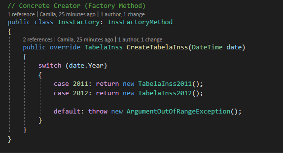
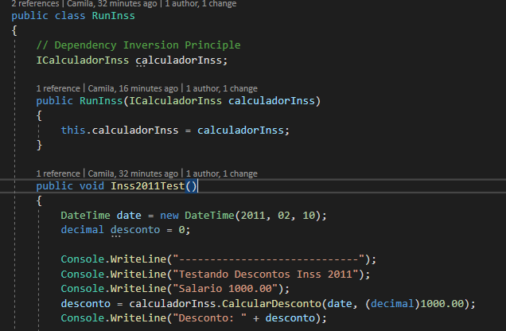
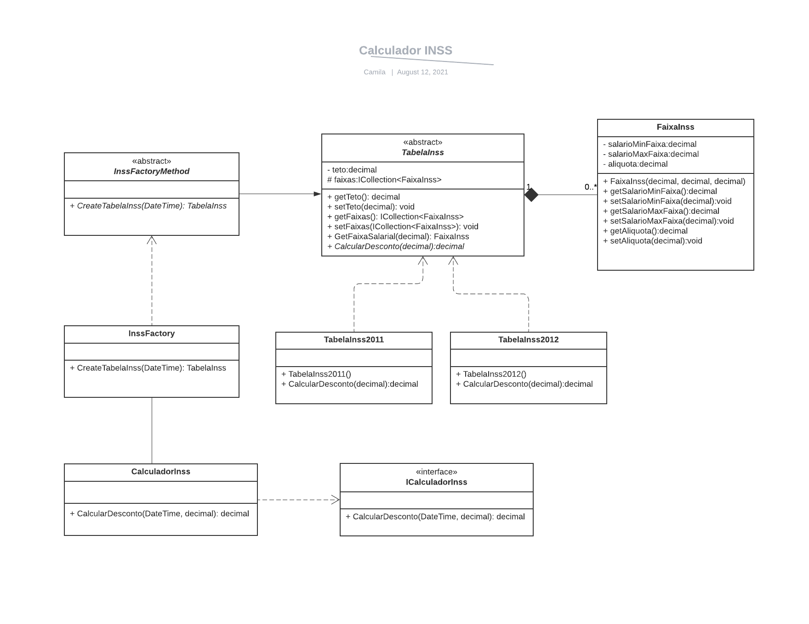

# Problema - IBM

## “Uma empresa precisa calcular o desconto do INSS sobre o salário dos seus empregados. ”. 
Camila Martins Dutra

Foi utilizado o Visual Studio 2019 para a resolução do problema.

<h2>Princípios do SOLID utilizados:</h2>

* Single Responsability Principle: Uma classe deve ter apenas uma responsabilidade.

* Open Closed Principle: Entidades de software devem estar abertas para extensão e fechadas para modificação. Exemplo da classe TabelaInss.

* Liskov Substitution Principle: Subclasses devem ser substituíveis por suas Superclasses. Exemplo de utilização na classe CalculadorInss, por meio do InssFactory (Cria o objeto do tipo TabelaInss2011 e retorna ele como TabelaInss):

* Dependency Inversion Principle: Módulos de alto nível não devem depender de módulos de baixo nível, ambos devem depender de abstrações.  Exemplo da classe RunInss que depende da interface ICalculadorInss para fazer o calculo do desconto (por meio da utilização de Dependency Injection):

<h2>Design Pattern utilizado para resolver o problema: </h2>

Utilizei o padrão criacional Factory Method para criar o objeto TabelaInss dentro do método CalcularDesconto, de forma que o objeto é criado sem necessidade de posterior modificação da classe CalculadorInss. 

<h2>Observações:</h2>

Na classe abstrata TabelaInss criei o método "abstract CalcularDesconto" para que as subclasses implementem este método pois, caso o cálculo do desconto do INSS sofra alguma modificação nos próximos anos, evitamos que a classe CalculadorInss tenha que sofrer alguma modificação no futuro.

Para facilitar o entendimento da solução e do uso do Factory Method, criei um diagrama de classes, CalculadorInss.png, que está presente dentro do diretório Problemas c#/Problemas.

